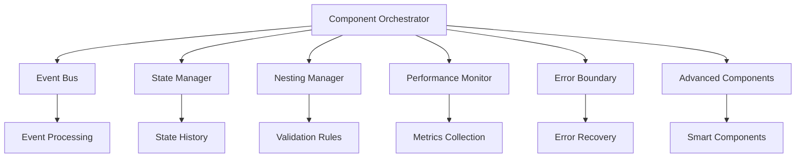

# Component Nesting System - Developer Guide

## Table of Contents
1. [Overview](#overview)
2. [Architecture](#architecture)
3. [Getting Started](#getting-started)
4. [Core Concepts](#core-concepts)
5. [Component Types](#component-types)
6. [Nesting Rules](#nesting-rules)
7. [State Management](#state-management)
8. [Event System](#event-system)
9. [Performance](#performance)
10. [Error Handling](#error-handling)
11. [Advanced Features](#advanced-features)
12. [Demo Templates](#demo-templates)
13. [Testing](#testing)
14. [API Reference](#api-reference)
15. [Best Practices](#best-practices)
16. [Troubleshooting](#troubleshooting)

## Overview

The Component Nesting System is a comprehensive framework for building complex, hierarchical user interfaces with advanced component architecture. It provides:

- **Hierarchical Component Management**: Organize components in parent-child relationships
- **Intelligent State Management**: Centralized state with history and undo/redo
- **Event-Driven Architecture**: Decoupled communication between components
- **Performance Monitoring**: Real-time metrics and optimization suggestions
- **Error Boundaries**: Component isolation and recovery mechanisms
- **Advanced Component Types**: Smart containers, conditional rendering, dynamic lists
- **TypeScript Support**: Complete type definitions for better development experience

### Key Features

✅ **Deep Nesting Support**: Handle complex component hierarchies with validation  
✅ **Smart Containers**: Adaptive layouts that optimize based on content  
✅ **Conditional Rendering**: Components that show/hide based on state or conditions  
✅ **Dynamic Lists**: Virtualized lists with sorting, filtering, and grouping  
✅ **State Containers**: Isolated state management for component groups  
✅ **Event Bridges**: Route and transform events between components  
✅ **Performance Optimization**: Automatic monitoring and optimization suggestions  
✅ **Error Recovery**: Graceful error handling with fallback content  

## Architecture

### System Components



### Data Flow

1. **Component Creation**: Orchestrator coordinates system initialization
2. **State Initialization**: State manager creates component state
3. **Nesting Validation**: Nesting manager validates parent-child relationships
4. **Event Registration**: Event bus sets up communication channels
5. **Performance Tracking**: Monitor starts collecting metrics
6. **Error Boundaries**: Error handler creates isolation boundaries

## Getting Started

### Installation

```javascript
// Import the orchestrator
import ComponentOrchestrator from './js/modules/componentOrchestrator.js';

// Create and initialize
const orchestrator = new ComponentOrchestrator();
await orchestrator.initialize({
    enablePerformanceMonitoring: true,
    enableErrorBoundaries: true,
    enableAdvancedComponents: true,
    debugMode: false
});
```

### Basic Usage

```javascript
// Create a simple component
const component = await orchestrator.createComponent({
    type: 'container',
    component: 'my-container',
    category: 'layout',
    subcategory: 'containers',
    props: {
        className: 'bg-white p-4 rounded-lg shadow'
    }
});

// Create a child component
const childComponent = await orchestrator.createComponent({
    type: 'component',
    component: 'my-button',
    category: 'ui',
    subcategory: 'forms',
    parentId: component.id,
    props: {
        text: 'Click Me',
        variant: 'primary'
    }
});
```

### Advanced Example

```javascript
// Create a smart container with conditional content
const smartContainer = await orchestrator.createComponent({
    type: 'smart-container',
    component: 'adaptive-layout',
    category: 'layout',
    subcategory: 'smart',
    props: {
        adaptiveLayout: true,
        responsiveBreakpoints: ['sm', 'md', 'lg', 'xl'],
        maxChildren: 20
    }
});

// Add conditional component
const conditionalComponent = await orchestrator.createComponent({
    type: 'conditional',
    component: 'user-content',
    category: 'logic',
    subcategory: 'conditional',
    parentId: smartContainer.id,
    props: {
        condition: 'user.isLoggedIn',
        conditionType: 'expression',
        trueContent: '<div>Welcome back!</div>',
        falseContent: '<div>Please log in</div>'
    }
});

// Add dynamic list
const dynamicList = await orchestrator.createComponent({
    type: 'dynamic-list',
    component: 'user-posts',
    category: 'data',
    subcategory: 'list',
    parentId: smartContainer.id,
    props: {
        virtualized: true,
        maxVisibleItems: 10,
        items: [],
        itemTemplate: 'post-card'
    }
});
```

## Core Concepts

### Component Hierarchy

Components are organized in a tree structure where each component can have:
- **One Parent**: The component that contains this component
- **Multiple Children**: Components nested within this component
- **Siblings**: Components that share the same parent

```javascript
// Get component tree
const tree = orchestrator.getComponentTree();

// Navigate hierarchy
const parentState = orchestrator.stateManager.getState(parentId);
const childrenIds = parentState.children;

// Get component depth
const depth = orchestrator.nestingManager.getComponentDepth(componentId);
```

### Component Lifecycle

1. **Creation**: Component is instantiated and registered
2. **Initialization**: State is created and event listeners are set up
3. **Mounting**: Component is added to the DOM hierarchy
4. **Updates**: Component responds to state changes and prop updates
5. **Unmounting**: Component is removed from DOM
6. **Destruction**: Cleanup and memory deallocation

### Component Identity

Each component has:
- **Unique ID**: Generated automatically or provided
- **Type**: Defines the component behavior (container, conditional, etc.)
- **Component Name**: The specific component implementation
- **Category/Subcategory**: Organizational classification
- **Props**: Configuration and data properties

## Component Types

### Standard Components

#### Container Components
```javascript
{
    type: 'container',
    component: 'section',
    category: 'layout',
    subcategory: 'containers'
}
```

#### UI Components
```javascript
{
    type: 'component',
    component: 'button',
    category: 'ui',
    subcategory: 'forms'
}
```

### Advanced Components

#### Smart Container
Adapts layout based on content and screen size:

```javascript
{
    type: 'smart-container',
    component: 'adaptive-grid',
    category: 'layout',
    subcategory: 'smart',
    props: {
        adaptiveLayout: true,
        responsiveBreakpoints: ['sm', 'md', 'lg'],
        layoutStrategy: 'auto', // 'grid', 'flex', 'masonry'
        maxChildren: 50,
        contentAnalysis: true
    }
}
```

#### Conditional Component
Renders content based on conditions:

```javascript
{
    type: 'conditional',
    component: 'user-panel',
    category: 'logic',
    subcategory: 'conditional',
    props: {
        condition: 'user.role === "admin"',
        conditionType: 'expression', // 'state', 'prop', 'custom'
        trueContent: '<div>Admin Panel</div>',
        falseContent: '<div>Access Denied</div>',
        evaluateOnStateChange: true
    }
}
```

#### Dynamic List
Efficiently renders large lists with virtualization:

```javascript
{
    type: 'dynamic-list',
    component: 'product-list',
    category: 'data',
    subcategory: 'list',
    props: {
        items: [], // Array of data items
        virtualized: true,
        itemHeight: 120, // Fixed height for virtualization
        maxVisibleItems: 20,
        sortable: true,
        filterable: true,
        groupBy: 'category',
        keyField: 'id'
    }
}
```

#### State Container
Provides isolated state management:

```javascript
{
    type: 'state-container',
    component: 'form-state',
    category: 'logic',
    subcategory: 'state',
    props: {
        initialState: {
            formData: {},
            isValid: false,
            errors: {}
        },
        persistent: true,
        stateKey: 'user-form',
        shareWithChildren: true
    }
}
```

#### Event Bridge
Routes events between components:

```javascript
{
    type: 'event-bridge',
    component: 'form-bridge',
    category: 'logic',
    subcategory: 'events',
    props: {
        eventMappings: [
            { from: 'form:submit', to: 'api:save' },
            { from: 'form:validate', to: 'validator:check' }
        ],
        filterEvents: true,
        transformEvents: true
    }
}
```

## Nesting Rules

### Validation System

The nesting manager enforces rules to maintain component hierarchy integrity:

```javascript
// Check if nesting is allowed
const result = nestingManager.canNest(parentType, childType, childComponent);
console.log(result.allowed); // boolean
console.log(result.reason);  // explanation if not allowed
```

### Default Rules

1. **Depth Limits**: Maximum nesting depth of 10 levels
2. **Component Compatibility**: Certain components cannot be nested
3. **Performance Limits**: Warnings for excessive children
4. **Semantic Validation**: HTML semantic rules enforcement

### Custom Rules

```javascript
// Add custom nesting rule
nestingManager.addNestingRule({
    name: 'no-buttons-in-buttons',
    condition: (parent, child) => {
        return !(parent.component === 'button' && child.component === 'button');
    },
    message: 'Buttons cannot contain other buttons'
});
```

### Performance Considerations

- **Child Limits**: Containers warn when exceeding 50 children
- **Depth Warnings**: Deep nesting (>8 levels) triggers optimization suggestions
- **Memory Monitoring**: Track memory usage per component tree branch

## State Management

### Component State Structure

```typescript
interface ComponentState {
    id: string;
    type: string;
    component: string;
    category: string;
    subcategory: string;
    props: Record<string, any>;
    children: string[];
    parent: string | null;
    isVisible: boolean;
    isSelected: boolean;
    hasError: boolean;
    errorMessage: string | null;
    lastModified: number;
    created: number;
    metadata: {
        depth: number;
        index: number;
        [key: string]: any;
    };
}
```

### State Operations

```javascript
// Get component state
const state = stateManager.getState(componentId);

// Update state
stateManager.setState(componentId, {
    isVisible: false,
    customProperty: 'value'
});

// Update props
stateManager.updateProps(componentId, {
    className: 'new-class',
    disabled: true
});

// Subscribe to state changes
const unsubscribe = stateManager.subscribe(componentId, (newState, oldState) => {
    console.log('State changed:', newState);
});
```

### History Management

```javascript
// Undo last action
const canUndo = stateManager.undo();

// Redo action
const canRedo = stateManager.redo();

// Get history
const history = stateManager.getHistory();

// Clear history
stateManager.clearHistory();
```

### State Persistence

```javascript
// Export state for saving
const stateData = stateManager.exportState();
localStorage.setItem('componentState', JSON.stringify(stateData));

// Import saved state
const savedData = JSON.parse(localStorage.getItem('componentState'));
stateManager.importState(savedData);
```

## Event System

### Event Types

```javascript
// Component lifecycle events
eventBus.on('component:created', handler);
eventBus.on('component:updated', handler);
eventBus.on('component:destroyed', handler);

// State events
eventBus.on('component:state:changed', handler);
eventBus.on('component:state:validation-failed', handler);

// Nesting events
eventBus.on('component:child:added', handler);
eventBus.on('component:child:removed', handler);
eventBus.on('component:moved', handler);

// Performance events
eventBus.on('performance:alert', handler);
eventBus.on('performance:optimization', handler);

// Error events
eventBus.on('error-boundary:error', handler);
eventBus.on('error-boundary:recovery', handler);
```

### Event Emission

```javascript
// Emit custom event
eventBus.emit({
    type: 'custom:event',
    source: 'my-component',
    data: { message: 'Hello World' },
    propagate: true
});

// Emit with namespace
const componentEvents = eventBus.namespace('my-component');
componentEvents.emit('button:clicked', { buttonId: 'save-btn' });
```

### Event Middleware

```javascript
// Add middleware for event processing
const removeMiddleware = eventBus.use(async (event) => {
    // Log all events
    console.log('Event:', event.type, event.data);
    
    // Modify event data
    if (event.type === 'component:created') {
        event.data.timestamp = Date.now();
    }
    
    // Cancel event by returning false
    if (event.type === 'dangerous:action') {
        return false;
    }
});
```

### Event Filtering

```javascript
// Filter events by type
const removeFilter = eventBus.addFilter((event) => {
    // Only allow component events
    return event.type.startsWith('component:');
});
```

## Performance

### Monitoring

The performance monitor tracks:
- **Component Creation Time**: Time to create components
- **Render Performance**: Component rendering duration
- **Memory Usage**: Heap size and component memory footprint
- **Event Processing**: Event handling performance
- **State Updates**: State change processing time

```javascript
// Get performance metrics
const metrics = performanceMonitor.getMetrics();
console.log('Global metrics:', metrics.global);
console.log('Component metrics:', metrics.components);

// Get specific component metrics
const componentMetrics = performanceMonitor.getMetrics(componentId);
console.log('Render time:', componentMetrics.averageRenderTime);
```

### Optimization Suggestions

The system automatically provides optimization suggestions:

```javascript
// Get optimization suggestions
const suggestions = performanceMonitor.getOptimizationSuggestions();
suggestions.forEach(suggestion => {
    console.log(`${suggestion.type}: ${suggestion.message}`);
});

// Get suggestions for specific component
const componentSuggestions = performanceMonitor.getOptimizationSuggestions(componentId);
```

### Performance Best Practices

1. **Limit Nesting Depth**: Keep hierarchies under 8 levels
2. **Use Virtualization**: Enable for lists with >100 items
3. **Batch State Updates**: Group related state changes
4. **Monitor Memory**: Watch for memory leaks in long-running apps
5. **Optimize Re-renders**: Use conditional components to reduce updates

### Virtualization

For large lists, enable virtualization:

```javascript
const largeList = await orchestrator.createComponent({
    type: 'dynamic-list',
    component: 'large-dataset',
    props: {
        virtualized: true,
        itemHeight: 80, // Fixed height required
        maxVisibleItems: 20,
        items: largeDataset // Array with 10,000+ items
    }
});
```

## Error Handling

### Error Boundaries

Each component automatically gets an error boundary that:
- **Isolates Errors**: Prevents errors from cascading
- **Provides Fallbacks**: Shows fallback content on errors
- **Enables Recovery**: Allows manual or automatic recovery
- **Logs Errors**: Tracks errors for debugging

```javascript
// Set custom fallback content
errorBoundary.setFallbackContent(componentId, `
    <div class="error-fallback">
        <h3>Something went wrong</h3>
        <button onclick="errorBoundary.recoverComponent('${componentId}')">
            Try Again
        </button>
    </div>
`);

// Set recovery strategy
errorBoundary.setRecoveryStrategy(componentId, 'fallback'); // 'retry', 'isolate', 'remove', 'reset'
```

### Error Types

- **Render Errors**: Component rendering failures
- **State Errors**: Invalid state updates
- **Nesting Errors**: Invalid component hierarchy
- **Performance Errors**: Performance threshold violations
- **Validation Errors**: Data validation failures

### Error Recovery

```javascript
// Manual recovery
const recovered = errorBoundary.recoverComponent(componentId);

// Subscribe to error events
errorBoundary.onError(componentId, (error) => {
    console.log('Component error:', error);
    // Custom error handling logic
});

// Get error statistics
const errorStats = errorBoundary.getErrorStatistics();
console.log('Total errors:', errorStats.totalErrors);
```

## Advanced Features

### Smart Container Intelligence

Smart containers analyze their content and adapt:

```javascript
// Content analysis results
const analysis = smartContainer.methods.analyzeContent();
console.log('Suggested layout:', analysis.layoutSuggestion);
console.log('Optimizations:', analysis.optimizations);

// Manual optimization
smartContainer.methods.optimizeLayout();

// Responsive adaptation
smartContainer.methods.adaptToBreakpoint('md');
```

### Conditional Logic

Conditional components support complex conditions:

```javascript
// Expression-based conditions
condition: 'user.role === "admin" && user.permissions.includes("write")'

// State-based conditions
condition: 'isLoading'
conditionType: 'state'

// Custom function conditions
condition: (component) => {
    return component.props.visible && !component.state.hasError;
}
conditionType: 'custom'
```

### Dynamic Content

Dynamic lists provide advanced features:

```javascript
// Sorting
dynamicList.methods.sortItems((a, b) => a.name.localeCompare(b.name));

// Filtering
dynamicList.methods.filterItems(item => item.category === 'featured');

// Adding items
dynamicList.methods.addItem(newItem, insertIndex);

// Removing items
dynamicList.methods.removeItem(itemIndex);
```

### State Containers

State containers provide isolated state management:

```javascript
// Get container state
const containerState = stateContainer.methods.getState();

// Update container state
stateContainer.methods.setState({ newProperty: 'value' });

// Subscribe to changes
const unsubscribe = stateContainer.methods.subscribe((newState) => {
    console.log('Container state changed:', newState);
});
```

## Demo Templates

The system includes comprehensive demo templates:

### E-commerce Product Page
- Complex product gallery with thumbnails
- Dynamic variant selection
- Conditional pricing display
- Nested review system
- Related products grid

### Analytics Dashboard
- Real-time KPI cards
- Interactive charts and graphs
- Filterable data tables
- Performance monitoring widgets
- Responsive grid layouts

### Blog Layout
- Featured article section
- Dynamic post listing with virtualization
- Nested comment system
- Sidebar widgets
- Category filtering

### Dynamic Form Builder
- Multi-step form progression
- Conditional field display
- Real-time validation
- State persistence
- Progress indicators

### Loading Templates

```javascript
import DemoTemplateManager from './js/demos/demoTemplates.js';

const templateManager = new DemoTemplateManager();
templateManager.setOrchestrator(orchestrator);

// Load e-commerce template
const result = await templateManager.loadTemplate('ecommerce-product');
console.log('Template loaded:', result.template.name);

// Get all available templates
const templates = templateManager.getAllTemplates();
templates.forEach(template => {
    console.log(`${template.name} (${template.difficulty}): ${template.description}`);
});
```

## Testing

### Test Suite

The system includes comprehensive tests:

```javascript
import ComponentTestSuite from './js/tests/componentTests.js';

const testSuite = new ComponentTestSuite();
testSuite.setOrchestrator(orchestrator);

// Run all tests
const results = await testSuite.runAllTests();

// Run specific category
const unitResults = await testSuite.runTestsByCategory('unit');

// Run specific test
const result = await testSuite.runTest('Component Creation');
```

### Test Categories

1. **Unit Tests**: Individual component functionality
2. **Integration Tests**: System interactions
3. **Performance Tests**: Speed and memory usage
4. **UI Tests**: Rendering and user interactions
5. **Stress Tests**: High load scenarios

### Custom Tests

```javascript
// Add custom test
testSuite.testCategories.custom = [
    {
        name: 'My Custom Test',
        description: 'Test custom functionality',
        test: async () => {
            // Test implementation
            const result = await myCustomFunction();
            testSuite.assert(result === expected, 'Result should match expected');
            return { success: true };
        }
    }
];
```

## API Reference

### ComponentOrchestrator

#### Methods

```typescript
// Initialization
async initialize(config?: OrchestratorConfig): Promise<void>

// Component Management
async createComponent(componentData: ComponentData): Promise<ComponentInstance>
async updateComponent(componentId: string, updates: Partial<ComponentData>): Promise<ComponentInstance>
async destroyComponent(componentId: string): Promise<void>

// Queries
getComponent(componentId: string): ComponentInstance | null
getAllComponents(): ComponentInstance[]
getComponentsByType(type: string): ComponentInstance[]
getComponentTree(): ComponentTree

// System Management
getStatistics(): SystemStatistics
exportData(): SystemExport
async importData(data: SystemExport): Promise<void>
async shutdown(): Promise<void>
```

### StateManager

#### Methods

```typescript
// State Operations
getState(componentId: string): ComponentState | null
setState(componentId: string, partialState: Partial<ComponentState>, skipHistory?: boolean): ComponentState
updateProps(componentId: string, newProps: Record<string, any>, merge?: boolean): ComponentState

// Hierarchy Management
addChild(parentId: string, childState: ComponentState): void
removeChild(parentId: string, childId: string): void
moveComponent(componentId: string, newParentId: string, index?: number): void

// History Management
undo(): boolean
redo(): boolean
getHistory(): HistoryEntry[]
clearHistory(): void

// Subscriptions
subscribe(componentId: string, callback: StateChangeCallback): () => void

// Persistence
exportState(): StateExport
importState(stateData: StateExport): void
```

### EventBus

#### Methods

```typescript
// Event Handling
on(eventType: string, callback: EventCallback, options?: EventOptions): () => void
once(eventType: string, callback: EventCallback, options?: EventOptions): () => void
off(eventType: string, listenerId: string): boolean
emit(event: Event | string): boolean
emitSync(event: Event | string): Promise<EventResult>

// Middleware and Filtering
use(middleware: EventMiddleware): () => void
addFilter(filter: EventFilter): () => void

// Utilities
namespace(prefix: string): EventNamespace
waitFor(eventType: string, timeout?: number): Promise<Event>
getMetrics(): EventMetrics
```

### NestingManager

#### Methods

```typescript
// Validation
canNest(parentType: string, childType: string, childComponent: string): NestingResult
validateNestingDepth(depth: number): ValidationResult
validateComponentHierarchy(componentId: string): ValidationResult

// Hierarchy Operations
addChild(parentId: string, childId: string, childData: ComponentData): Promise<void>
removeChild(parentId: string, childId: string): Promise<void>
moveComponent(componentId: string, newParentId: string, index?: number): Promise<void>

// Queries
getComponentDepth(componentId: string): number
getComponentPath(componentId: string): string[]
findComponents(predicate: ComponentPredicate): string[]

// Rules Management
addNestingRule(rule: NestingRule): void
removeNestingRule(ruleName: string): boolean
```

## Best Practices

### Component Design

1. **Single Responsibility**: Each component should have one clear purpose
2. **Composition Over Inheritance**: Use nesting to build complex interfaces
3. **Props vs State**: Use props for configuration, state for dynamic data
4. **Naming Conventions**: Use clear, descriptive names for components

### Performance Optimization

1. **Lazy Loading**: Load components only when needed
2. **Virtualization**: Use for large lists and tables
3. **State Batching**: Group related state updates
4. **Memory Management**: Clean up subscriptions and observers

### Error Handling

1. **Graceful Degradation**: Always provide fallback content
2. **Error Boundaries**: Use for component isolation
3. **Validation**: Validate props and state early
4. **Logging**: Log errors for debugging and monitoring

### Testing Strategy

1. **Unit Tests**: Test individual component behavior
2. **Integration Tests**: Test component interactions
3. **Performance Tests**: Monitor speed and memory usage
4. **User Tests**: Test actual user workflows

### State Management

1. **Minimize State**: Keep state as simple as possible
2. **Immutability**: Avoid direct state mutations
3. **Normalization**: Structure state for efficient access
4. **Persistence**: Save important state to localStorage

## Troubleshooting

### Common Issues

#### Component Not Rendering
```javascript
// Check if component exists
const component = orchestrator.getComponent(componentId);
if (!component) {
    console.error('Component not found:', componentId);
}

// Check component state
const state = orchestrator.stateManager.getState(componentId);
if (!state.isVisible) {
    console.log('Component is hidden');
}

// Check for errors
const errorStats = orchestrator.errorBoundary.getErrorStatistics();
if (errorStats.totalErrors > 0) {
    console.log('System has errors:', errorStats);
}
```

#### Performance Issues
```javascript
// Check performance metrics
const metrics = orchestrator.performanceMonitor.getMetrics();
if (metrics.global.memoryUsage > 50 * 1024 * 1024) {
    console.warn('High memory usage detected');
}

// Get optimization suggestions
const suggestions = orchestrator.performanceMonitor.getOptimizationSuggestions();
suggestions.forEach(s => console.log('Suggestion:', s.message));
```

#### State Not Updating
```javascript
// Check state manager
const state = orchestrator.stateManager.getState(componentId);
console.log('Current state:', state);

// Check event bus
const eventMetrics = orchestrator.eventBus.getMetrics();
if (eventMetrics.failedEvents > 0) {
    console.error('Event processing failures detected');
}
```

#### Nesting Validation Failures
```javascript
// Check nesting rules
const result = orchestrator.nestingManager.canNest(parentType, childType, childComponent);
if (!result.allowed) {
    console.error('Nesting not allowed:', result.reason);
}

// Check component depth
const depth = orchestrator.nestingManager.getComponentDepth(componentId);
if (depth > 10) {
    console.warn('Component nesting too deep:', depth);
}
```

### Debug Mode

Enable debug mode for detailed logging:

```javascript
await orchestrator.initialize({
    debugMode: true,
    enablePerformanceMonitoring: true,
    enableErrorBoundaries: true
});
```

### System Health Check

```javascript
// Get system statistics
const stats = orchestrator.getStatistics();
console.log('System health:', stats);

// Export system data for analysis
const exportData = orchestrator.exportData();
console.log('System export:', exportData);
```

### Memory Leaks

```javascript
// Monitor memory usage
if (performance.memory) {
    console.log('Memory usage:', {
        used: Math.round(performance.memory.usedJSHeapSize / 1024 / 1024) + 'MB',
        total: Math.round(performance.memory.totalJSHeapSize / 1024 / 1024) + 'MB',
        limit: Math.round(performance.memory.jsHeapSizeLimit / 1024 / 1024) + 'MB'
    });
}

// Clean up components
const allComponents = orchestrator.getAllComponents();
for (const component of allComponents) {
    if (component.shouldCleanup) {
        await orchestrator.destroyComponent(component.id);
    }
}
```

---

## Support and Contributing

For questions, issues, or contributions, please refer to:
- GitHub Issues: Report bugs and request features
- Documentation: This guide and inline code comments
- Examples: Demo templates and test cases
- Community: discussions and best practices

The Component Nesting System is designed to grow with your application needs while maintaining performance and reliability. Happy building! 🚀