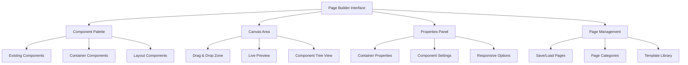
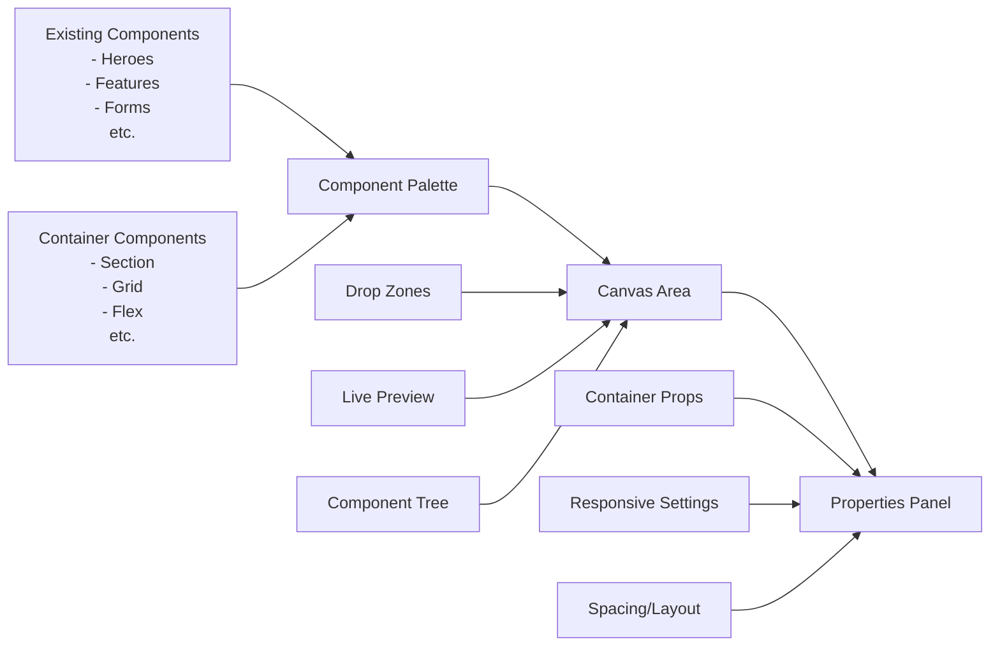

# 📋 TailwindUI Blocks Page Builder - Implementation Plan

## 🎯 Project Overview

We're adding a **Lego-style Page Builder** to the existing TailwindUI Blocks Library that allows users to create complex web pages by dragging and dropping components into container layouts. The page builder will support nested components, various container types, and save pages in organized categories.

## 🏗️ Architecture Overview



## 🧩 Component Structure Extensions

### New Container Components
We'll create a new category of **container components** that can hold other components:

1. **Basic Containers**
   - [`Section`](components/layout/containers/section/component.html) - Full-width section wrapper
   - [`Container`](components/layout/containers/container/component.html) - Max-width centered container
   - [`Grid`](components/layout/containers/grid/component.html) - CSS Grid (2-6 columns)
   - [`FlexRow`](components/layout/containers/flex-row/component.html) - Horizontal flexbox
   - [`FlexColumn`](components/layout/containers/flex-column/component.html) - Vertical flexbox

2. **Advanced Containers**
   - [`CustomGrid`](components/layout/containers/custom-grid/component.html) - Custom grid with configurable columns/rows
   - [`AbsoluteContainer`](components/layout/containers/absolute/component.html) - Absolute positioned container
   - [`StickyContainer`](components/layout/containers/sticky/component.html) - Sticky positioned container

3. **Semantic Containers**
   - [`Header`](components/layout/semantic/header/component.html) - Page header wrapper
   - [`Main`](components/layout/semantic/main/component.html) - Main content area
   - [`Footer`](components/layout/semantic/footer/component.html) - Page footer wrapper
   - [`Sidebar`](components/layout/semantic/sidebar/component.html) - Sidebar layout

### Enhanced Metadata Schema
```json
{
  "name": "Grid Container",
  "description": "Responsive CSS Grid container for organizing components",
  "category": "layout",
  "subcategory": "containers",
  "type": "container",
  "canContain": ["component", "container"],
  "maxChildren": 12,
  "defaultProps": {
    "columns": 3,
    "gap": 4,
    "responsive": true
  },
  "configurableProps": [
    {"name": "columns", "type": "number", "min": 1, "max": 6},
    {"name": "gap", "type": "select", "options": [2, 4, 6, 8]},
    {"name": "padding", "type": "select", "options": ["none", "sm", "md", "lg"]}
  ]
}
```

## 🎨 Page Builder Interface

### Main Interface Layout


### Key Features
1. **Component Palette** - Collapsible sidebar with searchable components
2. **Canvas Area** - Main drag-and-drop workspace with live preview
3. **Properties Panel** - Context-sensitive settings for selected elements
4. **Page Tree View** - Hierarchical view of page structure
5. **Responsive Preview** - Breakpoint testing like current viewer

## 🗂️ File Structure Extensions

```
TailwindUiBlocks/
├── components/
│   └── layout/                    # New container components
│       ├── containers/
│       │   ├── section/
│       │   ├── container/
│       │   ├── grid/
│       │   └── flex-row/
│       └── semantic/
│           ├── header/
│           ├── main/
│           └── footer/
├── pages/                         # New pages directory
│   ├── landing-pages/
│   │   └── startup-landing/
│   │       ├── page.json         # Page structure
│   │       ├── page.html         # Generated HTML
│   │       └── metadata.json     # Page metadata
│   ├── product-pages/
│   ├── about-pages/
│   └── templates/                # Sample templates
├── viewer/
│   ├── page-builder.php          # New page builder interface
│   ├── api/
│   │   ├── save-page.php         # Save page API
│   │   ├── load-page.php         # Load page API
│   │   └── generate-page.php     # Generate final HTML
│   └── js/
│       └── modules/
│           ├── pageBuilder.js    # Main page builder logic
│           ├── dragDrop.js       # Drag & drop functionality
│           ├── containerManager.js # Container management
│           └── pageManager.js    # Page save/load
```

## 🔧 Technical Implementation

### Page Data Structure
```json
{
  "id": "startup-landing-001",
  "name": "Startup Landing Page",
  "category": "landing-pages",
  "structure": {
    "type": "page",
    "children": [
      {
        "type": "container",
        "component": "header",
        "props": {"sticky": true},
        "children": [
          {
            "type": "component",
            "component": "top-navigation",
            "category": "application-ui",
            "subcategory": "navigation"
          }
        ]
      },
      {
        "type": "container",
        "component": "section",
        "props": {"padding": "lg"},
        "children": [
          {
            "type": "component",
            "component": "simple-hero",
            "category": "marketing",
            "subcategory": "heroes"
          }
        ]
      }
    ]
  }
}
```

### Drag & Drop Implementation
```javascript
class PageBuilder {
  constructor() {
    this.canvas = new Canvas();
    this.palette = new ComponentPalette();
    this.properties = new PropertiesPanel();
    this.pageManager = new PageManager();
  }
  
  initializeDragDrop() {
    // Enable drag from palette to canvas
    // Enable reordering within containers
    // Enable drag between containers
  }
  
  renderComponent(componentData) {
    // Render component with drop zones if it's a container
    // Add visual indicators for nested structure
  }
}
```

## 🎨 Sample Templates

### Template Categories
1. **Landing Pages**
   - Startup Landing
   - SaaS Product Landing
   - App Landing
   - Service Landing

2. **Product Pages**
   - E-commerce Product
   - Software Product
   - Service Description
   - Portfolio Showcase

3. **About Pages**
   - Company About
   - Team Page
   - Contact Page
   - FAQ Page

### Sample Template Structure
```json
{
  "name": "Startup Landing Template",
  "description": "Complete landing page for startups",
  "preview": "startup-landing-preview.jpg",
  "structure": {
    "type": "page",
    "children": [
      {"type": "component", "component": "top-navigation"},
      {"type": "component", "component": "hero-with-image"},
      {
        "type": "container",
        "component": "grid",
        "props": {"columns": 3},
        "children": [
          {"type": "component", "component": "three-column-features"}
        ]
      },
      {"type": "component", "component": "simple-pricing"},
      {"type": "component", "component": "simple-cta"}
    ]
  }
}
```

## 🚀 Implementation Phases

### Phase 1: Container Components (Week 1)
- [ ] Create basic container components (Section, Container, Grid, Flex)
- [ ] Implement container metadata schema
- [ ] Update component loading system to support containers
- [ ] Create container preview system

### Phase 2: Page Builder Interface (Week 2)
- [ ] Create [`page-builder.php`](viewer/page-builder.php) interface
- [ ] Implement component palette with containers
- [ ] Build drag-and-drop canvas area
- [ ] Add properties panel for container configuration

### Phase 3: Drag & Drop System (Week 3)
- [ ] Implement [`dragDrop.js`](viewer/js/modules/dragDrop.js) module
- [ ] Add visual drop zones and indicators
- [ ] Enable component reordering and nesting
- [ ] Implement undo/redo functionality

### Phase 4: Page Management (Week 4)
- [ ] Create pages directory structure
- [ ] Implement [`pageManager.js`](viewer/js/modules/pageManager.js)
- [ ] Build save/load page APIs
- [ ] Add page categorization and search

### Phase 5: Templates & Polish (Week 5)
- [ ] Create sample templates
- [ ] Add template preview system
- [ ] Implement page export functionality
- [ ] Performance optimization and testing

## 🎯 Success Metrics

1. **Usability**: Users can create a complete landing page in under 10 minutes
2. **Flexibility**: Support for 3+ levels of component nesting
3. **Performance**: Page builder loads in under 2 seconds
4. **Compatibility**: Generated pages work across all modern browsers
5. **Extensibility**: Easy to add new container types

## 🔄 Integration with Existing System

The page builder will integrate seamlessly with the existing viewer:

- **Navigation**: Add "Page Builder" tab to main navigation
- **Components**: Reuse all existing components
- **Theming**: Support current light/dark mode system
- **Responsive**: Use existing breakpoint system
- **Code View**: Show generated HTML/CSS like current viewer

---

This plan creates a powerful yet simple page builder that feels like "building with Lego blocks" while leveraging your existing component library and maintaining the same high-quality standards of your current viewer.